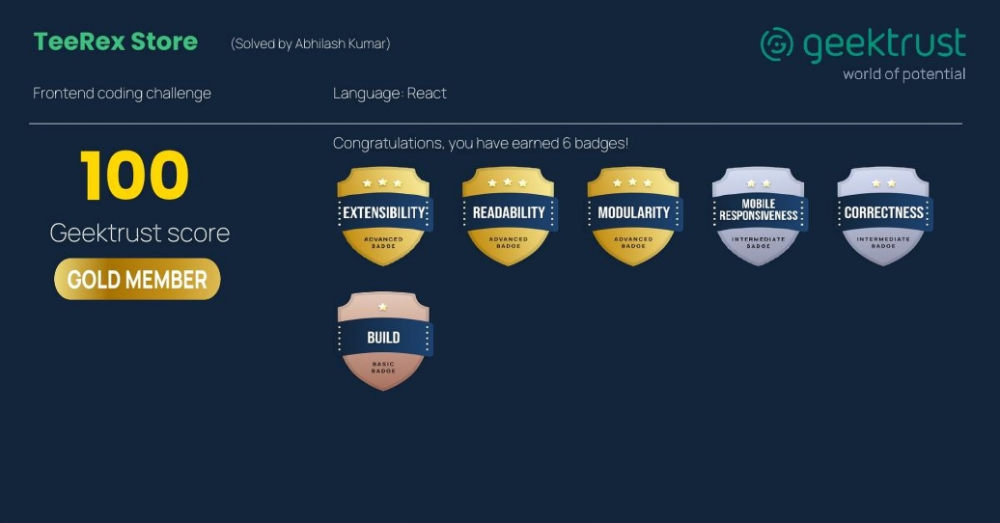
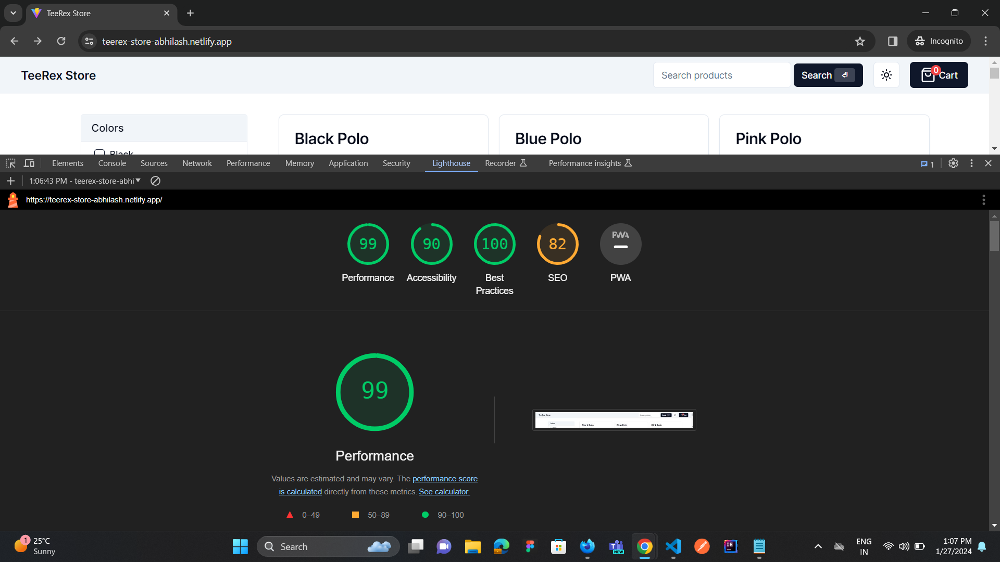

# TeerexStore - Frontend Coding Challenge

## Overview

This repository represents my submission for the Frontend coding challenge, achieving a perfect score of 100/100.



## Live Demo

Check out the live demo: [TeerexStore Demo](https://teerex-store-abhilash.netlify.app)

## Table of Contents

- [Features](#features)
- [Technologies Used](#technologies-used)
- [Installation](#installation)
- [Web Standards](#webstandards)

## Features

- **Responsive Design**: Ensures a seamless user experience across various devices.
- **State-of-the-Art UI**: Utilizes React and Typescript for a modern and interactive user interface.
- **Perfect Score**: Achieved a flawless 100/100 in the Frontend coding challenge.
- **Web standards**

## Technologies Used

- Vite JS
- React + Typescript
- Shadcn UI
- Tailwind CSS

## Installation

To run this project locally, follow these steps:

1. Clone the repository:

   ```bash
   git clone https://github.com/AbhilashMadi/geektrust-Challenges.git
   ```

2. Installing the dependencies:

   ```
   npm install
   ```

3. Starting the local server:

   ```
   npm start
   ```

## Web standards


