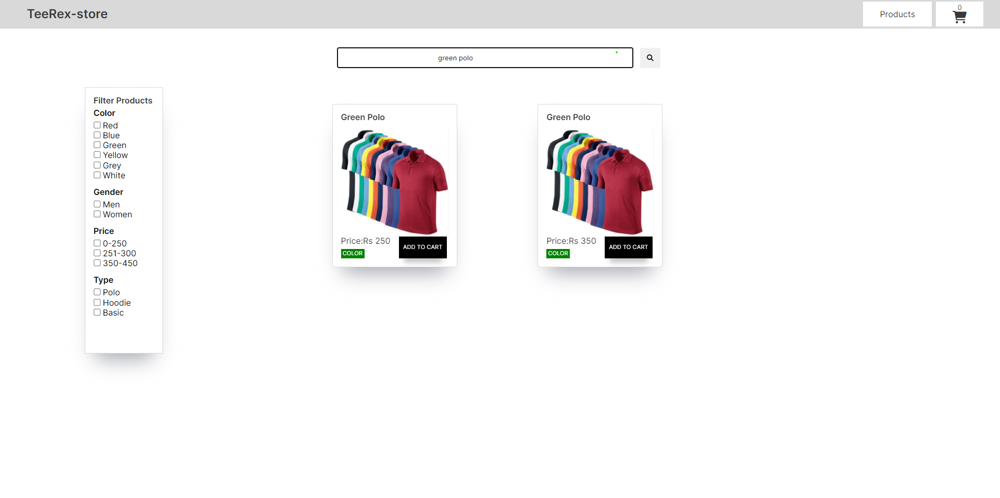
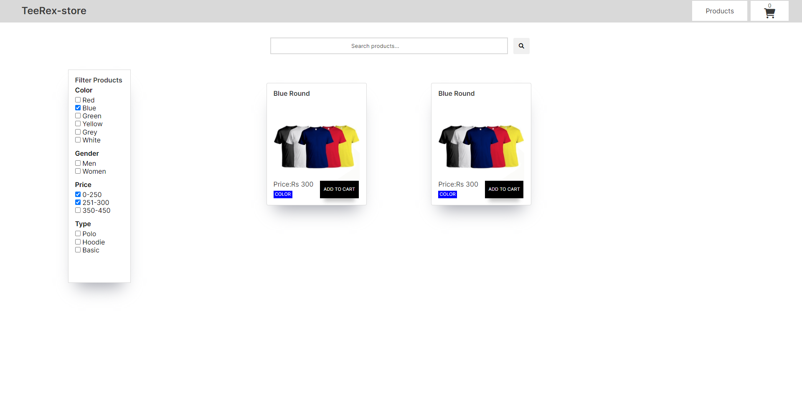
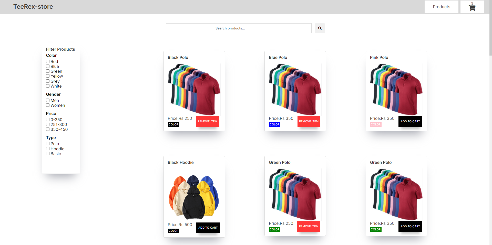
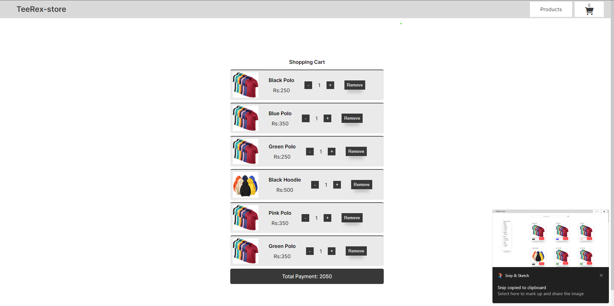
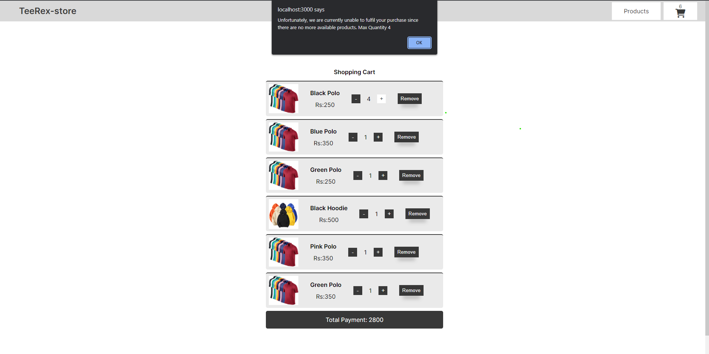
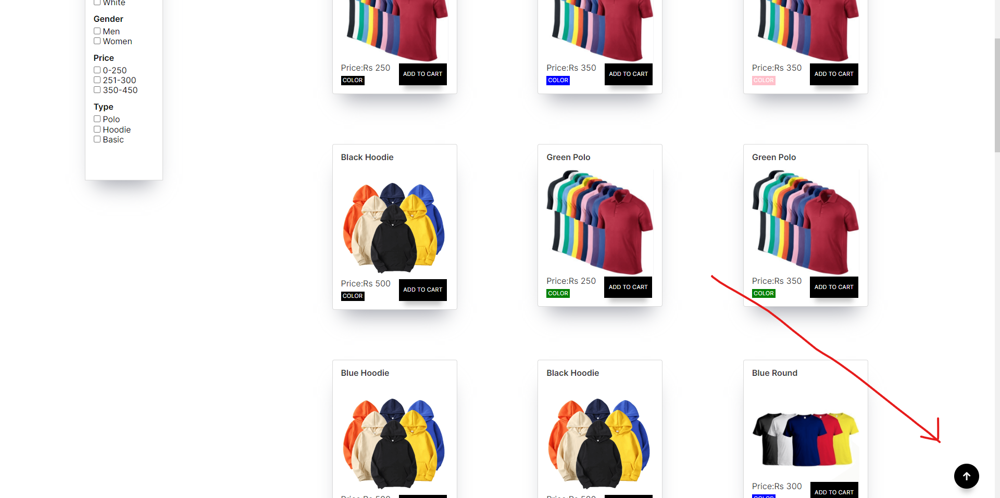

# GEEKTRUST ASSIGNMENT SUBMISSION

## TeeRex Store

During my Crio.Do INTV-1 sprint module, I chose the Teerex-store as my frontend skills testing task. I successfully implemented all of the details and rules provided by Geektrust, utilizing the **React** library for programming and **SCSS** for styling. I opted not to use any third-party libraries for this project.

### For UI reference I created a figma file

> [Figma File](https://www.figma.com/file/egnjVfQk0mq5dfBUFiEqI7/TeeRex-Store?node-id=31%3A5&t=yVnJtZQGM5Dotyg4-1)

### functionlity
 
- Browse the catalog on a product listing page.
- Each card have the product image, name, color and price.
- Search using free text which is a combination of one or more of the below  
  attributes
- Search will be work with both **enter key press** and **on clicking button**.
- example search
   - Name 
   - Colour 
   - Type 
   - gender
```
Eg. green polo
```



- Filter can be applied by itself or on top of the search results. 
- Filter for t-shirts using specific attributes
  - Gender 
  - Colour 
  - Price range 
  - Type



- Add one or more t-shirts to the shopping cart
- View the shopping cart by clicking the shopping cart icon



- Increase quantity or delete items from the shopping cart
- Display the total amount in the shopping cart.



- Every t-shirt type has a limited quantity. If the customer tries to order       more than the available quantity, he will get an alert message. 



- Ther is a button at the bottom right which will bring to the top of the page when it is clicked and it is visible to user when he scroll page more then 200px above.


 
- As for responsive design I used Grid, flexbox and media querys.

## CODE LOGIC

> ### API

- As per the provided JSON data by Geektrust, I have implemented the UI. To fetch the data into the frontend, I created a function called requestManager. This function takes the URL, headers, and the number of attempts as arguments, and it uses promises and Axios (which internally uses AJAX) to fetch the data. If the request for the data response fails, it will try the number of attempts given to pull the data from the backend. My intention for creating this function is to improve the functionality in case of overload of the backend or the browser not being able to fetch data at once.

``` javascript

  function requestManager(url,options={},attempts=3){
      return new Promise((resolve,reject) => {
          axios.get(url,options)
          .then(resolve)
          .catch((error) => {
              const isLastAttempt = attempts === 1;
              if(isLastAttempt){
                  return reject(error);
              }
              setTimeout(() => {
                  requestManager(url,options,attempts-1)
                  .then(resolve)
                  .catch(reject);
              },3000)
          });
      });
  };

```
---
- I folded entire App data into a *Context Provider* so that we can use the single stream root.

- I divided the UI into different components which are aviable in **atoms** folder.

- For styling I used **SCSS** for responsiveness I used **Media querys**.

> ### File Tree

```


│----TEEREX-README.md
│
├───public
│       index.html
│
└───src
    │   App.js
    │   config.js
    │   index.js
    │
    ├───assets
    │   └───readme
    │           addtocart.png
    │           alert.jpg.png
    │           brinttotop.png
    │           cartitem.png
    │           filter.png
    │           scrolltotop.png
    │           Search.png
    │
    ├───atoms
    │   │   exports.js
    │   │
    │   ├───cartProducts
    │   │       CartCard.jsx
    │   │       CartEmpty.jsx
    │   │       CartProducts.jsx
    │   │
    │   ├───common
    │   │       Navbar.jsx
    │   │
    │   ├───filterBar
    │   │       Category.jsx
    │   │       FilterBar.jsx
    │   │       FilterToggle.jsx
    │   │       Options.jsx
    │   │
    │   └───products
    │           Card.jsx
    │           NoProducts.jsx
    │           SearchBar.jsx
    │
    ├───context
    │       actions.js
    │       ProductContextProvider.js
    │       productReducer.js
    │       searchReducer.js
    │
    ├───pages
    │       CartPage.jsx
    │       exportPage.js
    │       LandingPage.jsx
    │       NoPages.jsx
    │
    ├───scss
    │   │   index.scss
    │   │   scrollbar.scss
    │   │   variables.scss
    │   │
    │   └───css
    │           index.min.css
    │           scrollbar.min.css
    │           variables.min.css
    │
    └───utility
            fetchData.js
            generateID.js
            goToTop.js
            utilityExport.js

```